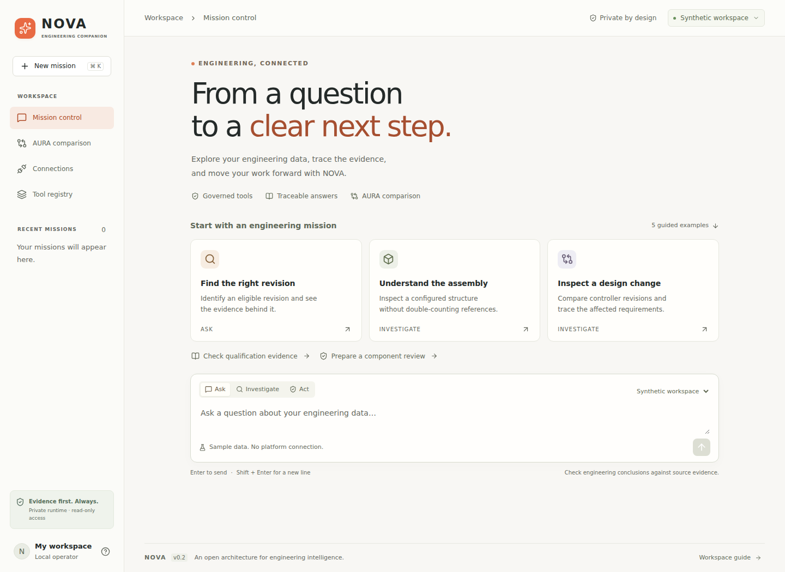

# NOVA · Engineering workspace

A natural-language workspace for engineering missions on 3DEXPERIENCE, with a governed semantic MCP gateway and an AURA observation lab.



**This repository contains a runnable application.** It starts with a synthetic engineering corpus and needs no platform credentials or model subscription. Live platform reads require private configuration and reviewed API contracts for the target release. No real tenant connection or AURA evaluation has been performed by this project.

## Run it

Use Node.js 22.12 or later (Node 24 recommended).

```bash
git clone https://github.com/opedoussaut/3dx-mcp-gateway.git
cd 3dx-mcp-gateway
npm ci
npm run dev
```

Open **http://127.0.0.1:3000**. Select a guided mission and press the arrow to run it. The source selector explicitly distinguishes **Synthetic workspace** from **My 3DEXPERIENCE**.

For the optimized application:

```bash
npm run build
npm start
```

The server binds to loopback. This is a private, single-operator application; the GitHub repository is the source distribution, not a hosted connection to a corporate tenant. GitHub Pages alone cannot run its private Node backend. Do not publish this runtime to the internet without adding an independently reviewed authentication, authorization and deployment boundary.

## What works

| Area                 | Implemented behavior                                                                                                                                                  |
| -------------------- | --------------------------------------------------------------------------------------------------------------------------------------------------------------------- |
| Mission control      | Natural-language input, Ask / Investigate / Act modes, five guided missions, session history, evidence inspection, execution traces and JSON export                   |
| Engineering missions | Revision eligibility under the supplied synthetic policy, configured occurrence counting, revision comparison, qualification evidence review and local review drafts  |
| Connection readiness | Server-side configuration checks, release-specific contract validation and a one-read identity check when a reviewed binding is installed                             |
| Read gateway         | Fixed tenant origin, named semantic tools, GET-only private bindings, bounded responses, field projection, explicit coverage, permission-denial stop and no redirects |
| MCP                  | A stdio server with two local utilities and six synthetic read adapters; live tools are exposed only when their private bindings are admitted                         |
| AURA comparison      | Exact prompt copying, shared synthetic context pack, manual answer/time/citation capture, optional human scores, context declaration and observation export           |
| Intelligence routing | Deterministic routing first; an optional local Ollama classifier for otherwise unrecognized intents, with explicit prompt-egress permission                           |

Known missions are solved by ordinary code over retrieved records. This version is not a general-purpose conversational model or a completed multi-agent implementation. The provider interface is designed for extensions; only the optional Ollama adapter is implemented, and a real model inference run has not been validated here.

## Connect your platform

Follow [the private connection guide](docs/CONNECTING.md). Configure the origin, release, security context, authentication and a reviewed binding file on your machine. The interface deliberately does not collect credentials.

No 3DEXPERIENCE endpoint is assumed to be supported based on a public example alone. The checked-in registry retains the blueprint's research classifications: **18 platform-backed candidates are pending contract verification**, while two NOVA utilities are local. A private operator-reviewed binding does not change the published research baseline.

The initial live adapter accepts reviewed **GET** reads only. Session/CAS login, token refresh, POST-based reads, pagination traversal, live eligibility policies, process launch and task completion are not implemented. A documented operation requiring one of these features needs an adapter change and corresponding validation. Incomplete or unknown search coverage remains explicit.

## Compare with AURA

1. Open **AURA comparison** and select a mission.
2. For a synthetic comparison, download the context pack and make the same facts accessible in AURA. The pack has source facts and review policy, but no scoring assertions.
3. Run NOVA, copy the exact prompt, and run it in your AURA environment.
4. Record the visible AURA response, release, competency, optional time and references. Confirm matching context only if that is actually true.
5. Save and export the observation. Unobservable AURA token counts, internal calls and costs remain `null` / `NOT_OBSERVABLE`.

The lab does not automate AURA or assert that NOVA outperforms it. NOVA server runtime and manually observed AURA interaction time have different timing boundaries. A single observation is not a benchmark conclusion; use the [benchmark protocol](docs/blueprint/benchmarks/scoring/PROTOCOL.md) for repeated, controlled assessment.

Mission history and observations are held in process memory, partitioned by an HTTP-only session cookie. They expire after eight hours of inactivity or disappear on restart. Export the records you want to retain. Exported live evidence may be confidential; keep those exports in your private workspace.

## MCP client configuration

The same semantic gateway is available to a local MCP client. Use an **absolute** Node executable and repository path in your client's configuration, and set its working directory to this repository:

```json
{
  "mcpServers": {
    "nova": {
      "command": "/absolute/path/to/node",
      "args": ["--import", "tsx", "/absolute/path/to/3dx-mcp-gateway/server/mcp.ts"],
      "cwd": "/absolute/path/to/3dx-mcp-gateway",
      "env": { "NOVA_MCP_SOURCE": "synthetic" }
    }
  }
}
```

Client configuration formats differ; adapt this stdio example to your client. Use `npm run mcp` for a terminal launch. Only protocol data is written to stdout. Set `NOVA_MCP_SOURCE=live` in the private runtime only after the connection guide is complete. Any MCP host receiving live evidence must itself be authorized for that data; the host controls its subsequent model egress.

## Verify

```bash
npm run check
npx playwright install chromium
npm run test:e2e
```

Tests cover synthetic mission outcomes, missing/ambiguous evidence, untrusted source text, contract admission, field grooming, origin and session controls, permission denials, actual MCP stdio exchange, browser workflows and accessibility. HTTP and model behavior are mocked where marked; these tests do not prove compatibility with a real 3DEXPERIENCE tenant or model installation.

## Structure

```text
src/                 React interface
server/              Local HTTP runtime, semantic gateway, mission runner, MCP server
shared/              Typed mission and observation contracts; benchmark prompts
config/              Deliberately blocked private-contract template
tests/               Runtime, HTTP, MCP and browser tests
docs/CONNECTING.md   Private runtime setup and limitations
docs/blueprint/      Technical blueprint, registry, schemas and synthetic fixtures
docs/decisions/      Architecture decision records
```

The blueprint is an architecture target. This v0.2 implementation is the first executable read-only slice; see [implementation scope](docs/IMPLEMENTATION.md) for the exact boundary. Corporate attachments, tenant exports and credentials are excluded from this public repository.
