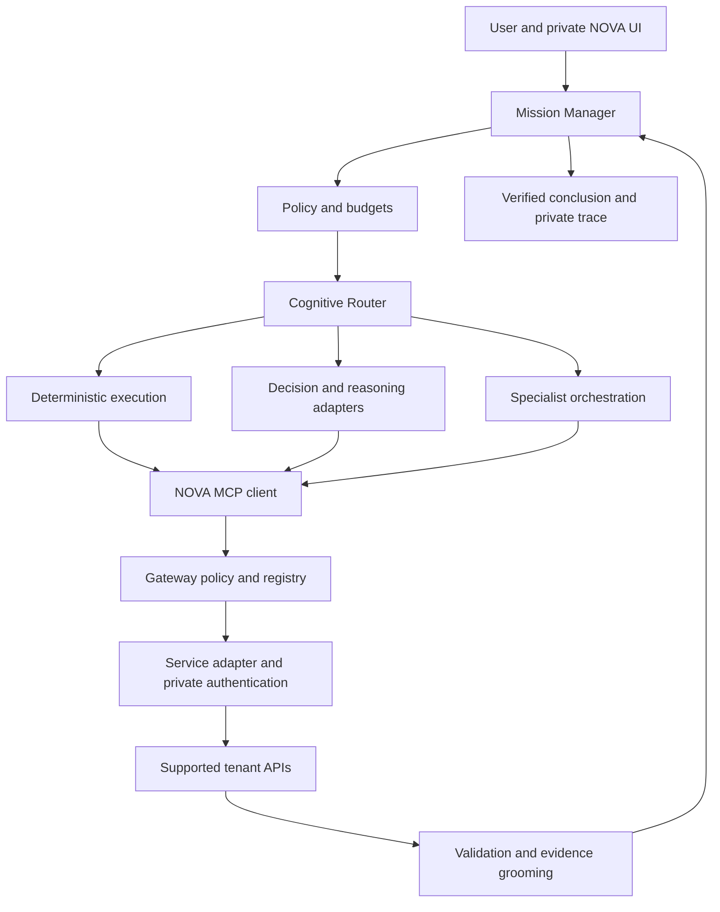

# NOVA Technical Blueprint

Version 0.1 | 5 October 2026 | Phase 0 architecture and research

## 1 Purpose and decision

NOVA is an open agentic reference architecture for engineering missions on 3DEXPERIENCE. Its governing principle is to use the minimum intelligence required to reach a trustworthy engineering decision. This blueprint defines a model-independent mission runtime, a governed MCP gateway, and a reproducible comparison with AURA. It is an architecture specification, not a working integration or a benchmark result.

**Decision:** start with a private, read-only gateway and one bounded engineering investigation. Publish original architecture, contracts, synthetic fixtures and evaluation procedures. Keep credentials, tenant configuration and corporate evidence outside the public project. Build deterministic execution first; add decision models and reasoning providers only when experiments justify them.

**Readiness:** this review identifies 20 candidate semantic tools: two NOVA-local utilities and 18 platform-backed candidates. No platform operation is marked IMPLEMENTABLE or enabled. Public sources establish credible capability and authentication leads, but a complete release-specific API contract was not verified. This is an evidence gap, not a conclusion that supported APIs do not exist.

The release-specific Cloud developer guide links and change files inspected through the official portal required sign-in. Documentation access requirements do not themselves make an API private. An authorized review must still establish its public API designation, support scope and exact contract. Do not substitute an internal documentation mirror or a captured browser request. [S01, S02]

### Deliverables and scope

The accompanying bundle contains a machine-readable candidate API registry and schema, original NOVA contracts, five benchmark missions, synthetic fixtures, a scoring protocol, a configuration example, ten initial ADRs and a source register. It contains no tenant exports, credentials, proprietary documentation, implementation SDKs or live run records. No deployment, tenant connection, write operation or AURA experiment was performed.

## 2 Public evidence and its limits

FACT denotes an observed source statement or access result. INFERENCE denotes a conclusion drawn from those facts. HYPOTHESIS denotes an outcome to test. NOVA design choices and proposed acceptance thresholds are requirements, not claims about existing vendor behavior.

| Evidence | Verified fact | Consequence for NOVA |
| --- | --- | --- |
| Developer portal [S01] | Lists Cloud R2026x FD04, FD03 and FD02 guides and public web-service change files; also separates on-premise documentation. | Pin deployment type and release. A portal listing does not establish the tenant's installed release. |
| Access check [S02] | The inspected FD04 and FD03 guide links led to 3DEXPERIENCE ID sign-in; inspected change files were also inaccessible. | Operation-level verification remains incomplete. |
| Platform openness [S03] | Describes REST, event messaging and import/export integration; mentions Basic Auth and OAuth at platform level. | This establishes architecture families, not OAuth grants or support for an individual endpoint. |
| Authentication examples [S04, S05] | Public articles describe CAS sessions and Cloud integration agents using Basic authentication; the latter identifies the PFI role and proxy-user licensing. | Investigate both patterns. Reconfirm current release, service coverage and entitlement before selecting one. |
| Passport change notice [S06] | Describes a Cloud URL change and distinguishes service-led CAS redirects from storing a Passport URL. | Do not derive authentication hosts from tenant naming conventions. |
| Engineering example [S07] | A 2026x GA example uses an effectivity read through POST, SecurityContext and ENO_CSRF_TOKEN, and discusses licenses. | Classify risk by documented semantics, not HTTP verb. This example is not a complete API contract. |
| Business Process update [S08] | A public 2025 update announces an Iterop API through API Gateway and states PFI is required. | A credible integration lead; exact inbound task/process contracts remain unverified. |
| AURA intended purposes [S09] | Lists knowledge, project, lifecycle, relation and engineering BOM functions with release information. | Compare the actual available competency, not an assumed question-answering baseline. |
| Nimble documentation [S12] | Describes a 9B typed decision model and the System-One interface; warns that output confidence is not calibrated correctness. | Treat it as an optional measured adapter, not an authorization engine or an assumed tiny model. |

**Inference:** the fastest credible route to a live pilot is to verify an integration-agent or supported interactive authentication profile, then engineering search and item retrieval for one release. **Hypothesis:** deterministic grooming and selective escalation can reduce cost at equivalent mission quality. Neither speed, savings nor superiority over AURA has been demonstrated.

### API verification gate

Use the four requested classifications without conflating them with implementation status:

| Classification | Admission meaning |
| --- | --- |
| PUBLIC_SUPPORTED | Official evidence identifies a public, supported operation for the specified release and deployment. |
| PUBLIC_UNCLEAR | Public material suggests a capability, but support, version or contract remains incomplete. |
| PRIVATE_OR_INTERNAL | Evidence identifies an internal or unsupported interface. Never admit it to NOVA's public integration. |
| UNKNOWN | Insufficient operation-level evidence. No guessed method, path, license or schema. |

An operation becomes IMPLEMENTABLE only after checking its official operation reference, public designation, release range, method/path, request and response contracts, authentication, CSRF behavior, authorization prerequisites, pagination, errors and retry semantics. Some fields can be explicitly not applicable; unexplained nulls cannot pass. Runtime enabling additionally requires configured authentication, entitlement, allowed security context, adapter tests and policy approval. PUBLIC_SUPPORTED is necessary, never sufficient.

Store source URLs, section or operation identifiers, access date, documentation release, evidence strength and open questions. Store null for unknown values. Preserve paths seen in examples under `observed_operation_leads`, separate from executable `operation` fields. Record documentation hashes only when legitimately available; do not invent them or republish vendor documentation without distribution rights.

## 3 Architecture and deployment boundary

The Mission Manager owns the mission state, budget, checkpoints and final outcome. A deterministic policy engine restricts every plan, model invocation and tool call. The Cognitive Router selects the least costly eligible execution strategy. Model providers, decision engines and specialist agents are replaceable components. The independent 3DEXPERIENCE MCP Gateway resolves semantic tool requests into verified API operations.

### Component responsibilities

| Component | Contract and responsibility |
| --- | --- |
| Mission Manager | Typed objective, success criteria, mode, deadline and budget; resumable states; explicit completion or abstention. |
| Policy engine | Deny by default; bind principal, tenant, context, data policy and allowed tools; cannot be overridden by models. |
| Cognitive Router | Choose deterministic, decision, small-model, reasoning, specialist or multi-agent strategy within policy. |
| Evidence pipeline | Validate source responses; preserve provenance, units, revisions and coverage; expose only approved fields. |
| Provider broker | Select a permitted model adapter; enforce data egress and usage limits; attach provider credentials outside prompts. |
| MCP client | Submit typed semantic calls and validate structured results; never supply arbitrary URLs or authentication headers. |
| MCP Gateway | Own platform authentication, approved service origins, registry admission, request construction and authorization binding. |
| Telemetry and evidence stores | Separate minimal operational metadata from access-controlled evidence and results; no automatic upload. |
| Benchmark runner | Freeze mission/corpus versions; record paired observations and missing metrics; never infer AURA internals. |

### Trust zones

The public repository contains original code/specifications, synthetic fixtures and safe examples. The private runtime contains configured service origins, credentials, identity mappings, evidence and local traces. A model endpoint is a separate trust zone even when marketed as enterprise or sovereign. Local execution is the initial default for corporate content; remote model egress requires an explicit permitted provider, data class and deployment policy.

A public demonstration site uses synthetic data and an isolated demonstration backend. It must not connect to the corporate tenant or prompt a visitor to paste corporate credentials. Run the corporate UI locally or on an approved private host, with its own authenticated backend. Model-agnostic architecture does not mean every provider is authorized for every dataset.

For the first private pilot, use one runtime and one separately permissioned gateway process. Prefer local stdio for MCP, avoiding an unnecessary network service. Later remote MCP requires transport authentication, client consent, validated token audiences and scoped authorization distinct from downstream 3DEXPERIENCE authentication. Pin a tested protocol/SDK combination; the official MCP specification and security guidance are the reference, not an assumption that tool annotations enforce access control. [S11]

## 4 Authentication and authorization

Authentication adapters must stay inside the gateway. The model sees semantic arguments and a sanitized result. It never sees usernames, passwords, integration secrets, cookies, tickets, OAuth tokens or CSRF values. Provider API keys similarly stay in the provider broker; agents receive no process environment containing secrets.

| Option | Evidence and suitability | Unresolved admission checks |
| --- | --- | --- |
| Cloud integration or Openness Agent | Public PFI article describes generated agent credentials and calls on behalf of a nominated 3DPassport user. Candidate for a private gateway. [S05] | Current role availability, API Gateway/service origins, permitted proxy user, service coverage, token/CSRF behavior and tenant policy. |
| Documented CAS or Passport session | Public examples describe login tickets, sessions and service-led redirects. Candidate for a supported user session. [S04, S06] | Exact current flow, SSO/MFA compatibility, renewals, cookies and supported client type. Never automate a guessed password flow. |
| OAuth for a particular service | Platform-level material mentions OAuth. [S03] | Issuer, supported grants, client registration, scopes, audiences and PKCE requirements must be verified per service. No general OAuth support inferred. |
| Business Process API Gateway | Public update identifies API Gateway and PFI. [S08] | API family/version, inbound authentication and licensed principal mapping. Legacy standalone Iterop authentication is not evidence for the integrated service. |

Do not export a browser cookie jar into NOVA, reuse AURA's hidden endpoints, or treat a signed-in browser as API authentication. Do not confuse an Iterop outbound connector's authentication options with authentication to its inbound API.

Authorization binds the actual authenticated platform principal to a tenant, roles/licenses, collaborative space, security context and object-level rights. Resolve sensitive identifiers through gateway-local handles. Model-supplied handles cannot change the principal, host or security context. Never use a broad service account to make a same-user benchmark appear successful.

On 401, allow at most one documented refresh and then stop. On 403, record AUTHORIZATION_DENIED and stop; no identity switching or alternate endpoint. On 404, retain the documented ambiguity between absence and inaccessible content where applicable. Retry 429/temporary faults only under documented limits, bounded backoff and cancellation. Search completeness is not guaranteed when pagination, indexing or access is incomplete.

The configuration example names future local settings without values. Select exactly one verified platform authentication profile. Prefer OS keychain or a secret manager; environment injection is a local development fallback. Never enter secret values in chat, terminal history, screenshots, source control or a public configuration form. The precise runtime setup instructions follow contract verification, not speculative endpoint configuration.

## 5 Security and governed actions

### Controls that remain outside the model

1. Admit only registry-approved operations and allowlisted service origins. Reject arbitrary URLs, redirects to unapproved origins, private-network pivots and unbounded downloads. A privately deployed tenant can use an explicitly approved private origin; it is not discovered from returned content.
2. Validate typed input and bounded output. Apply byte, page, depth, item and time limits before processing. Defend parsers and archive handling. Cap decompression and parsing work.
3. Keep platform responses in the private data plane. Project allowed fields, remove known sensitive values and apply a data-class egress decision before any model call. If sensitive material is detected or the classification is uncertain, stop or use a permitted local path.
4. Treat retrieved text as untrusted evidence, including instructions embedded in wiki pages, descriptions or tool results. Content cannot register tools, modify prompts/policies, change destinations or grant approval. Injection detection is supplementary; capability enforcement is the control.
5. Partition caches and evidence by tenant, principal, security context and authorization epoch. Apply TTLs, revocation handling and permission rechecks; never reuse one user's evidence for another.
6. Keep logs on an allowlist of metadata fields. Drop authorization, cookie, token and secret values from headers, query strings, exception messages and provider SDK tracing. Known-value redaction is defense in depth, not proof that arbitrary text is safe.
7. Disable prompt/body logging and external analytics by default. Scan commits, exports and built assets for secrets and sensitive data. A sanitized trace is still private until its publication review passes.

### Risk and approval policy

| Risk | Intended semantics | Initial NOVA behavior |
| --- | --- | --- |
| L0 DISCOVER | NOVA capability metadata | Allowed locally; does not probe tenant endpoints. |
| L1 READ | Verified read/search, including a documented read-only POST | Allowed only after API and runtime gates; subject to data egress controls. |
| L2 SAFE WRITE | Narrow, genuinely reversible drafts | Disabled in Phase 1; explicit preparation and approval when introduced. |
| L3 ENGINEERING WRITE | Engineering creation or modification | Disabled; prepare/approve/commit plus preconditions. |
| L4 CRITICAL | Delete, promotion, release or material operational effects | Disabled; narrowly scoped workflow, explicit approval and recovery design required. |

Starting a process or completing a task may trigger external effects. Assign at least L3 until the actual process effects are reviewed; elevate to L4 when appropriate. Calling something a draft does not establish reversibility. A POST is not automatically a write, and a GET is not automatically safe without its contract.

### Prepare and commit protocol

Prepare an immutable action containing principal, tenant alias, context, operation/adapter version, canonical payload, targets, expected versions, impact summary, expiry and a one-use nonce. The trusted runtime hashes and signs this envelope; the approval UI renders the exact values from that same envelope. A digest alone does not establish who approved it.

Approval records the authenticated approver and signed digest. Commit accepts the prepared handle, not replacement arguments. Recheck permissions, expiry, signature, nonce and upstream version/preconditions, then atomically consume the nonce. Any material change requires a new preparation. Where supported, use an upstream conditional request and idempotency facility. Otherwise disable operations that cannot meet the required concurrency protection. A gateway cannot guarantee exactly-once execution across an ambiguous network timeout without upstream support: record COMMIT_UNKNOWN, reconcile, and never blindly replay. Capture outcome and a verified compensating action where possible.

## 6 Cognitive routing and decision models

The escalation ladder is an ordering of preferred mechanisms, not a requirement to invoke every level. Solve exact lookups and calculations deterministically. A complex mission may move directly to an eligible reasoning strategy when cheaper routes demonstrably cannot satisfy its criteria. A missing permission or missing evidence is a reason to stop, not to buy more reasoning.

| Route | Typical use | Exit or escalation condition |
| --- | --- | --- |
| DETERMINISTIC | Filtering, joins, unit conversion, comparisons, schema checks | Complete criteria, or explicit evidence/schema gap. |
| DECISION_MODEL | Narrow route selection or anomaly flag | Valid answer in permitted set; otherwise abstain. |
| SMALL_MODEL | Bounded extraction or explanation | Schema and evidence checks pass; else repair once or escalate. |
| REASONING_MODEL | Ambiguous evidence and multi-step planning | Grounded result passes checks within budget. |
| SPECIALIST_AGENT | Domain-specific plan with a restricted toolset | Domain criterion and evidence coverage pass. |
| MULTI_AGENT | Independent, separable work or justified challenge | Merge only validated outputs; conflicts remain visible. |

The deterministic router first filters options by privacy, risk, tool availability, budget and runtime health. Its initial policy is explicit rules. A learned decision adapter can later rank only the eligible options. Each route record includes inputs used, rule/model version, eligible alternatives, selected path, concise rationale, expected budget and fallback. Learned routing cannot enable tools, downgrade risk or approve writes.

Maintain a task profile with complexity, uncertainty, evidence coverage, required capabilities, context size, criticality, latency target and observed historical success. Choose the cheapest eligible route expected to meet a predefined quality floor. Penalize validation failures and unnecessary escalation. Treat new task families as unknown rather than trusting aggregate success on unrelated tasks.

### Decision model abstraction

`DecisionRequest` carries a task identifier, feature-schema version, minimized state, finite allowed decisions, abstention option and latency budget. `DecisionResult` carries decision or ABSTAIN, model/artifact version, raw score, calibration version, measured latency, usage and concise supporting feature references. Deterministic rules, a tiny trained classifier and a Jev-style service are distinct adapters. Do not label rules as a trained model.

Ollama documents System-One at `/v1/systemone` from version 0.35. Nimble is a 9B model; it is not equivalent to a tiny parameter-count router. Its documented confidence represents answer concentration rather than demonstrated correctness. The page also contains inconsistent SDK/context presentation, so pin and test the HTTP contract before integration rather than relying on a convenience SDK. [S12, S13]

Measure local latency, memory and energy where available on the intended machine. Do not transfer vendor laptop timings or benchmark accuracy to NOVA. Include local inference compute in economics even where marginal API charges are zero. Validate abstention and thresholds on held-out mission families; record coverage versus error, calibration and unsafe under-escalation. Thresholds stay unset until calibration. Never train on the held-out AURA comparison suite.

## 7 Model providers and specialist execution

`ModelRequest` contains a provider-neutral task kind, allowed data class, evidence handles, typed output contract, permitted tool definitions, token/time/cost limits and a cancellation identifier. A provider adapter maps these into its own API. Capability discovery records supported structured outputs, tool use, streaming, context budget, usage reporting, approved region and retention configuration. Unsupported capabilities fail explicitly; adapters do not silently flatten away guarantees.

`ModelResponse` normalizes structured output, proposed tool calls, model/version, finish status, usage by billing category, latency, and redacted error category. Tool calls are proposals routed through gateway policy; providers never execute platform actions directly. Provider secrets, raw headers and raw network errors are excluded. Keep vendor-specific options behind a versioned adapter configuration so the core does not depend on one provider's semantics.

Initial provider interfaces cover a local/open runtime and replaceable OpenAI, Anthropic and Google adapters. This names adapter targets, not tested integrations or permission to transmit corporate data. Pin model IDs, SDK versions and pricing snapshots when implementation begins; do not hard-code a marketing label as a permanent capability guarantee.

Optional independent reasoning runs two approved models on the same frozen evidence without showing either the other's answer. Compare claims and provenance deterministically where possible. Disagreement triggers further evidence collection or human review; majority agreement is not a correctness oracle. Enable it only for a predeclared mission class with a measured benefit and a budget.

Specialists receive a bounded sub-mission, evidence subset, capability subset and budget. Suggested future agents cover engineering, structure, requirements, knowledge, change, process, quality, simulation and sustainability. Spawn none for a task a deterministic pipeline can complete. Persist parent-child trace IDs, cancellation and merge rules. An external agent protocol can be added later; MCP is the tool boundary and does not by itself provide agent-to-agent coordination.

## 8 Evidence grooming and economics

Transform RAW DATA into FILTERED DATA, EVIDENCE and MODEL CONTEXT using deterministic steps. Apply permissions before retrieval, validate responses, normalize units, deduplicate by source/revision, preserve graph occurrence semantics, retain contradictions, then select mission-relevant evidence. A summary never upgrades source authority. Missing fields and inaccessible branches remain explicit.

An evidence record contains a gateway handle, source operation, retrieval time, revision/configuration, field-level facts, units, trust label, provenance handle and coverage state. Public fixtures use synthetic identifiers. Real identifiers and deep links remain in a protected map and are resolved for an authorized UI, not sent indiscriminately to models. Native object types and schema details remain tied to the verified adapter.

Record raw/filtered/evidence record counts and bytes separately from token counts. For context reduction, use one named tokenizer and identical serialization boundaries: reduction equals 1 minus groomed-context tokens divided by raw-context tokens. If no model is invoked, model-context tokens are zero, while evidence processing remains counted. This does not mean total compute cost is zero. A zero denominator yields not applicable.

Count every provider call, retry, decision invocation, specialist invocation, semantic MCP call and underlying API request. A single tool can fan out to many APIs. Record end-to-end wall time separately from summed stage time and human waiting time. A trace includes mission, plan version, evidence references, routing, models, tools, API operation IDs, validation, approval, outcome and correlation ID. Store concise auditable decisions, not hidden model reasoning.

Calculate model charges from actual usage and the pinned price schedule, including cached input, output and other billable categories when reported. Mark missing usage or pricing as UNKNOWN, never zero. Separate inference charges, local compute estimates, infrastructure allocation, platform/license or task-credit costs and human effort. Report cost per successful mission over all attempted missions, so failures are not free. Monetize engineering value only with a declared and independently measured baseline.

## 9 Candidate semantic tools

This is a capability plan, not a claim that every underlying API exists. LOCAL_SPEC_READY means an original NOVA utility can be implemented without a 3DEXPERIENCE API; it is deliberately not IMPLEMENTABLE platform status. Every platform candidate remains BLOCKED_PENDING_VERIFICATION and `enabled_by_default=false`.

| ID | Semantic tool | Group and risk | Current evidence status |
| --- | --- | --- | --- |
| T01 | list_capabilities | Discovery L0 | Local registry view; LOCAL_SPEC_READY. |
| T02 | get_runtime_status | Discovery L0 | Local readiness flags only; LOCAL_SPEC_READY. |
| T03 | get_current_user | Identity L1 | UNKNOWN; identity endpoint unverified. |
| T04 | list_security_contexts | Identity L1 | UNKNOWN; context enumeration contract unverified. |
| T05 | search_engineering_items | Search L1 | PUBLIC_UNCLEAR; search example described in S04. |
| T06 | get_engineering_item | Engineering L1 | PUBLIC_UNCLEAR; engineering API family evidenced in S07. |
| T07 | get_product_structure | Structure L1 | PUBLIC_UNCLEAR; exact expansion/configuration contract absent. |
| T08 | get_effectivity | Structure L1 | PUBLIC_UNCLEAR; POST read example in S07. |
| T09 | get_related_documents | Documents L1 | UNKNOWN; relationship and document contracts needed. |
| T10 | get_requirements | Requirements L1 | UNKNOWN; object/relation contracts needed. |
| T11 | search_knowledge | Knowledge L1 | UNKNOWN; AURA retrieval capability does not prove an external API. |
| T12 | get_wiki_content | Knowledge L1 | UNKNOWN; exact 3DSwym read contract needed. |
| T13 | search_datasets | Datasets L1 | UNKNOWN; no verified dataset search operation. |
| T14 | get_dataset_card | Datasets L1 | UNKNOWN; no verified dataset metadata operation. |
| T15 | list_processes | Process L1 | PUBLIC_UNCLEAR; gateway announcement S08. |
| T16 | get_my_tasks | Tasks L1 | PUBLIC_UNCLEAR; task operation and user filtering unverified. |
| T17 | get_task | Tasks L1 | PUBLIC_UNCLEAR; exact read/assignment contract absent. |
| T18 | start_process | Process L3 minimum | PUBLIC_UNCLEAR; side effects and contract unresolved. |
| T19 | complete_task | Tasks L3 minimum | PUBLIC_UNCLEAR; side effects and contract unresolved. |
| T20 | prepare_change | Change L3 | UNKNOWN; future immutable proposal, with commit separately gated. |

T20 preparation must not create a platform change object. It can become a local preparation utility once its target operation is verified; a separate commit capability is out of scope. Creation, revision, simulation and collaboration remain future taxonomy groups rather than invented initial implementations.

The registry separates proposed semantic schemas from verified upstream schemas. Its required fields cover service/domain, API/version, operation/method/path, documentation, authentication, CSRF, roles/licenses, security context, input/output, read/write semantics, risk, idempotency, approvals, semantic mapping and admission state. No unknown upstream schema is replaced with a permissive catch-all and called verified.

## 10 First read only vertical slice

**Mission:** identify the admissible revision of a synthetic cooling assembly and explain whether it is ready for a component review, using current engineering item evidence. It ends in an engineering triage conclusion, not a release approval. Fixture terms such as REVIEW_ELIGIBLE are NOVA test semantics; a verified adapter must map the tenant's actual lifecycle representation.

1. Freeze mission intent, evaluation date and declared admissibility rule. Use a synthetic assembly with two revisions, one superseded; include a duplicate title on an unrelated item.
2. Route lookup, disambiguation and eligibility checks to deterministic code. A structured mission card is sufficient initially; free text must be confirmed against a typed interpretation if ambiguous.
3. Through a verified gateway profile, search engineering items and retrieve the selected object's authoritative revision, status and required metadata. If search remains blocked, a user-selected gateway handle may support an explicitly narrower retrieval-only run, never reported as full-slice completion.
4. Groom results into a compact evidence ledger retaining the excluded candidates and exclusion reasons. Preserve timestamps, source references, missing fields and coverage.
5. Apply deterministic reasoning against declared criteria. An optional approved model can explain the ledger, but cannot override the checks. Record a deliberate zero-model route when no model is needed.
6. Return the selected revision, admissibility decision, evidence citations, limitations and next engineering action. If critical fields are unavailable, return INSUFFICIENT_EVIDENCE.
7. Display the complete private trace, API/MCP counts, latency and measured context/cost metadata. No platform writes occur.

**Proposed acceptance gate:** verify authentication, search and item-read contracts; reproduce every expected assertion in the synthetic success, ambiguity, denied-access, incomplete-pagination and injection cases; produce no unauthorized calls or secret-bearing logs; and preserve identical conclusions with the optional explanation layer disabled. These are acceptance targets, not achieved results. An offline fixture run is useful but is labeled SYNTHETIC_OFFLINE; it does not satisfy the live milestone.

Once this works, add configured product structure and requirement/knowledge retrieval as independently admitted extensions. Do not expand the first dependency chain to every platform service.

## 11 Benchmark protocol and five missions

Treat AURA as a black box and NOVA as an instrumented system. Public documentation provides candidate competencies and intended purposes, not proof of accuracy or of your tenant's configuration. The product page also describes blue-token consumption; blue tokens are not LLM tokens and require an observable billing basis for a monetary comparison. [S09, S10]

Use two clearly separated tracks. **Common-access track:** same user or verified equivalent principal, tenant, permissions, mission, accessible corpus, revision snapshot and success criteria. **Deployment-capability track:** record each system's actual accessible sources/tools and configuration. Unequal access is a measured integration difference, not clean causal evidence about agent architecture. Even a matched black-box comparison cannot isolate architecture from undisclosed models, retrieval and product implementation.

### Representative missions

| Mission | Engineering question | Golden outcome and main controls |
| --- | --- | --- |
| B01 Retrieve | Which revision of the cooling assembly is admissible for today's component review? | Select the eligible revision using supplied policy; exclude superseded and title-collision objects; cite evidence. |
| B02 Understand | Explain the configured product structure and count installed fan modules. | Count occurrences rather than unique references; honor configuration; distinguish known counts from inaccessible branches. |
| B03 Reason | What changed between two controller revisions, and which requirements need review? | Identify the seeded connector change and explicit requirement links; do not invent transitive effects. |
| B04 Investigate | What supported company knowledge justifies replacing the thermal interface material? | Prefer applicable current evidence; expose conflicting or out-of-scope studies; abstain when evidence cannot justify a choice. |
| B05 Prepare | Investigate a component substitution and prepare the engineering actions and process request. | Combine traceable findings, missing checks and exact proposed action; no commit. Later ACT testing uses an isolated authorized sandbox. |

Select missions before observing either system's failures. The supplied fixtures are original synthetic data, with separate expected assertions for evaluators. Never give answer keys to agents. Develop additional disjoint mission instances before making comparative claims; five seed cases do not support a general performance ranking.

### Execution and scoring

Freeze the evaluation protocol, mission text, fixtures, date/configuration, success checks, time limit and permitted assistance before each paired run. Record NOVA code/registry/provider versions and AURA tenant release, competency, language and visible configuration. Start fresh sessions, randomize or counterbalance system order and wait for equivalent indexing. Track warm and cold cache conditions separately. Use at least five repetitions per mission/system as an initial variability pilot; repeated runs do not create new independent mission families.

Capture AURA through its normal authorized UI and a human observation form unless a supported test API is verified. Do not extract undocumented endpoints or hidden telemetry. Record all failures and deviations. A permission denial is a valid observed outcome; whether it is correct depends on the fixture's expected access. An intentionally inaccessible fixture can reward an appropriate abstention.

Primary outcome is task success: all critical assertions pass, no unsupported critical conclusion, and no prohibited action/data exposure. A hard security violation fails the run regardless of answer quality. Score correctness, completeness, groundedness and usefulness on a predeclared 0-4 rubric. Use two independent engineering reviewers for judgment-based items, blind to system identity where feasible; record disagreements and adjudication. An LLM judge can assist, not provide the sole ground truth.

Secondary measures include user turns/assistance, completion time, failure recovery, trace coverage, context efficiency and engineering outcome. NOVA-only internals include token usage, tool choice, API fan-out, model/agent invocations and costs. Store each metric as OBSERVED, ESTIMATED, NOT_OBSERVABLE, NOT_APPLICABLE or NOT_RUN. AURA's unobservable internals remain null. Do not penalize hidden internal tracing as an execution failure; compare user-visible evidence separately.

Report task-level paired results, denominators, failures, uncertainty and access differences. Use confidence intervals only with an appropriate independent unit of analysis; cluster at mission instance/family when repeated runs share a task. Do not publish a global winner from this pilot. Evaluate routing and grooming through within-NOVA ablations on a held-out synthetic corpus at equal budgets: deterministic baseline, fixed reasoning provider, then routing, grooming and optional specialists. This can test NOVA design contributions more directly than the AURA comparison.

## 12 User experience

ASK opens a focused answer or retrieval task. INVESTIGATE shows the mission, current evidence gap and next bounded step. ACT shows an exact prepared operation and its approval state; in the first milestone it is visibly unavailable. Lead with the engineering conclusion and evidence coverage rather than a wall of runtime widgets.

Use a clean neutral canvas, restrained engineering-blue accents and generous spacing. A single expandable trace exposes mission, plan, evidence, decision route, reasoning summary, agents, MCP, platform operations, cost and result. Show mechanisms actually used: DETERMINISTIC with zero model calls is a successful route, not an empty visualization. Label fixture runs prominently and never animate simulated calls as live tenant activity.

The comparison view aligns one mission and its predeclared success criteria. Show NOVA and AURA outcomes, observed latency, interactions and evidence citations; missing metrics read NOT OBSERVABLE or NOT RUN. A verdict requires completed runs. No fictional scores, fabricated cost savings or guesses about AURA's internal models appear in the design.

## 13 Delivery gates and unresolved questions

| Phase | Deliverable | Exit gate |
| --- | --- | --- |
| 0 | This blueprint, evidence register and ADRs | Reviewable boundaries and explicit blockers; API verification still open. |
| 1 | Read-only gateway and deterministic vertical slice | Verified current contracts, local auth and negative security tests. |
| 2 | Mission state machine and rule-based router | Reproducible traces, budgets and deterministic baseline. |
| 3 | Decision and multiple provider adapters | Held-out calibration, privacy gates and measured economics. |
| 4 | Restricted specialist execution | Demonstrable task benefit against simpler baselines. |
| 5 | Controlled ACT | Approval binding, concurrency, replay and timeout reconciliation tests. |
| 6 | Paired AURA study | Matched conditions, complete observations and independent scoring. |
| 7 | Public demonstrator | Synthetic assets, publication review and reproducible setup. |

The next engineering step is a release-specific contract verification package, covering the actual Cloud/on-premise release, authorized integration profile, service origins, public operation identifiers and request/response schemas for engineering search and item retrieval. No credentials are needed for the blueprint review. Configure secrets only locally when the verified adapter is ready.

Open questions include the tenant release; supported authentication and PFI entitlement; security-context selection; service-specific read licenses; public structure and configuration APIs; knowledge/dataset API availability; Business Process inbound contracts and side effects; AURA competencies and corpus parity; model egress permission; and distribution rights for any third-party artifacts. These are independent gates. A model fallback cannot resolve them.

Other material risks are API drift, index lag, incomplete evidence, routing miscalibration, prompt injection, cache leakage, approval replay and attribution bias. Mitigate them through pinned contracts and deprecation review, explicit coverage, abstention, capability controls, partitioned caches, signed single-use actions and a paired benchmark protocol. Track each risk's evidence and owner role without publishing corporate identities.

## 14 Architecture decision records

The bundle includes full records with context, decision, consequences and verification criteria. They are adopted as blueprint design choices; implementation compliance is not yet established.

| ADR | Decision |
| --- | --- |
| 001 | Public architecture and private runtime with separate publication review. |
| 002 | Semantic MCP tools only; no general production REST executor. |
| 003 | Replaceable model providers behind a data and credential boundary. |
| 004 | Policy-constrained routing with deterministic execution first. |
| 005 | Exact prepare/approve/commit binding for governed mutations. |
| 006 | Platform content is untrusted evidence. |
| 007 | Public supported operations require release-specific admission. |
| 008 | Benchmark AURA as a configured black box and disclose confounders. |
| 009 | Minimal private telemetry and separate evidence storage. |
| 010 | Begin with a read-only slice and synthetic offline tests. |

## 15 Public sources

Sources were inspected on 5 October 2026. Public community examples are leads and carry less evidential weight than a complete release-specific developer contract. Vendor product statements are attributed claims, not independent benchmark results. No internal documentation is included or cited.

S01. Dassault Systemes, Developer guides. Current portal listing and documentation entry points. https://www.3ds.com/support/documentation/developer-guides

S02. Dassault Systemes, Cloud R2026x FD04 and FD03 Developer Assistance. Access check reached sign-in; contract contents not inspected. https://media.3ds.com/support/documentation/developer/cloud/R2026x-FD04/en/DSDoc.htm?show=CAADocQuickRefs%2FDSDocHome.htm and https://media.3ds.com/support/documentation/developer/cloud/R2026x-FD03/en/DSDoc.htm?show=CAADocQuickRefs%2FDSDocHome.htm

S03. Dassault Systemes, 3DEXPERIENCE Platform Openness. https://www.3ds.com/3dexperience-platform/openness

S04. ENOVIA User Community, 3DEXPERIENCE Web Services Postman Primer, 17 December 2020. Historical examples, not current contract verification. https://3dswym.3dexperience.3ds.com/post/enovia-user-community/3dexperience-web-services-postman-primer_TGle4SV2RFOt9z8alqjtKw

S05. ENOVIA User Community, 3DEXPERIENCE RESTful Web Services Authentication Alternative, 8 July 2021. Historical PFI integration-agent description. https://3dswym.3dexperience.3ds.com/post/enovia-user-community/3dexperience-restful-web-services-authentication-alternative_uizUNOc8Tcuh0Wj_pWm5og

S06. 3DEXPERIENCE platform users community, New changes on 3DPassport Service url, 12 September 2022. https://3dswym.3dexperience.3ds.com/post/3dexperience-platform-user-s-community/new-changes-on-3dpassport-service-url_y1tBP80iThGttF1sJTmDLQ

S07. DELMIA Process Engineering community, Get Variant Effectivity on Eng Item or Resource, 5 March 2026, 2026x GA example. https://3dswym.3dexperience.3ds.com/wiki/delmia-process-engineering/get-variant-effectivity-on-eng-item-or-resource_HZQW4kyHTiyk9c0HC_jnRQ

S08. 3DEXPERIENCE platform users community, Business Process Designer, 29 April 2025. Public API Gateway announcement only; linked internal documentation was not used. https://3dswym.3dexperience.3ds.com/wiki/3dexperience-platform-user-s-community/business-process-designer_fu5BkDD5SJiXJh1RndAgjg

S09. Dassault Systemes, AI-Based Functionality Intended Purpose. https://www.3ds.com/trust-center/trusted-ai/ai-intended-purpose

S10. Dassault Systemes, AURA AI Virtual Companion. Vendor description and commercial consumption model. https://www.3ds.com/products/3dexperience/aura

S11. Model Context Protocol, specification and security guidance. https://modelcontextprotocol.io/specification/2026-07-28 and https://modelcontextprotocol.io/docs/2026-07-28/tutorials/security/security_best_practices

S12. Ollama, Nimble model documentation. https://ollama.com/library/nimble

S13. Ollama, Ollama now supports Jev-style decision models, 29 September 2026. https://registry.ollama.com/blog/ollama-now-supports-jev-style-decision-models
