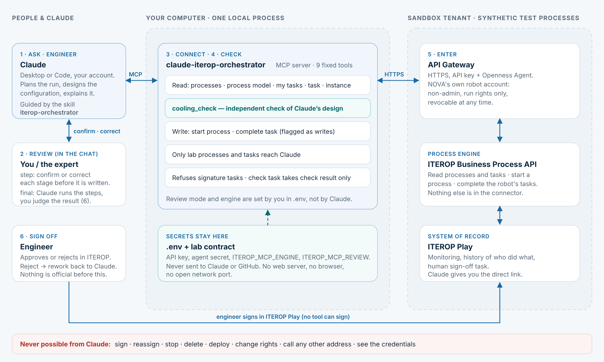

# claude-iterop-orchestrator — Claude drives ITEROP directly

The simplified architecture has no NOVA web server and no UI. One small MCP server sits between your Claude account and ITEROP:



```
You ──► Claude (Desktop / Code, your account) ──MCP stdio──► claude-iterop-orchestrator ──HTTPS──► API Gateway ──► ITEROP
            plans, engineers, asks you,                      holds the credentials,                 (sandbox tenant,
            explains                                         9 fixed tools                           NOVA robot account)
```

- **Claude is the orchestrator.** It reads the process model, asks for missing inputs, **engineers the configuration itself** (coolant, CDU sizing, loop temperatures and flows) and has it independently checked. It presents one proposal for your approval, then starts the process, completes each task, and tells you when an engineer has to sign.
- **The connector is deliberately small** (`server/iterop-mcp.ts`, `server/iterop/direct.ts`). It holds the API key and the Openness Agent secret, so they never reach Claude. It translates the field ids the designer generated, shows only the reviewed lab processes and their tasks, and exposes exactly these tools:

| Tool | ITEROP operation |
|---|---|
| `iterop_connection` | none (configuration, presence only) |
| `iterop_list_startable_processes` | `getAllStartableProcesses` (filtered to lab processes) |
| `iterop_get_process_model` | `getBasicProcessInfo` + the lab model (start form, tasks, fields) |
| `iterop_list_my_tasks` | `getTasksByUser` (filtered to lab processes) |
| `iterop_get_task` | `getTaskInstanceInformations` |
| `iterop_get_instance` | `getInstanceInfo` |
| `cooling_check` | none (local): independent check of Claude's proposal — energy balance, lab limits, redundancy, plausibility |
| `iterop_start_process` | `startProcess` — **write** |
| `iterop_complete_task` | `completeTask` — **write**; signature tasks refused |

There is no tool for signing, reassigning, stopping, deleting, deploying or rights, and no generic "call any URL" tool.

**Review mode** (`ITEROP_MCP_REVIEW` in `.env`, chosen by you, not by Claude):
- `step` (default) — an expert checks each stage. Claude proposes the values with its reasoning, the expert confirms or corrects them, and only then is that stage written.
- `final` — you trust Claude with the automated steps. It designs, checks independently, starts the run and completes the automated tasks. You validate only the final result: the engineer's sign-off task in ITEROP (Approve, or Reject → rework back to Claude). Claude stops and asks if the independent check fails.

In both modes the "Check system limits" task accepts only the independent check's result, and sign-off is always a person in ITEROP.

**One setting:** `ITEROP_MCP_REVIEW` alone decides how writes are reviewed. In `step` mode, Claude asks the expert in the chat before each stage. In `final` mode, it runs the automated stages and the result is validated at the ITEROP sign-off. The two write tools are also flagged as writes, so a Claude client may show its own permission prompt depending on its permission mode. That prompt is extra protection, not the review itself. For a strict `step` demo, use Claude's default ("ask") permission mode rather than auto mode.

## Setup

1. Get the branch:
   ```bash
   git fetch origin claude-iterop-orchestrator
   git checkout claude-iterop-orchestrator
   npm ci
   ```
2. In `.env`, keep the sandbox settings you already have (`NOVA_LAB_GATEWAY_ORIGIN`, `NOVA_LAB_API_KEY`, `NOVA_LAB_AGENT_ID`, `NOVA_LAB_AGENT_SECRET`, `NOVA_LAB_CONTRACT_FILE`, optionally `NOVA_LAB_PLAY_ORIGIN`) and add:
   ```dotenv
   ITEROP_MCP_ENGINE=live      # omit or "simulated" to rehearse without the tenant
   ITEROP_MCP_REVIEW=step      # or final: Claude runs the automated steps, you validate the result
   ```
3. **Claude Desktop:** *Settings → Developer → Edit config*. Add the server to `claude_desktop_config.json`, then fully quit and restart Claude Desktop:
   ```json
   {
     "mcpServers": {
       "iterop": {
         "command": "cmd",
         "args": ["/c", "cd /d E:\\users\\opt2.ai\\NOVA\\3dx-mcp-gateway && node --import tsx server/iterop-mcp.ts"]
       }
     }
   }
   ```
   If the old `nova-lab` entry is there, remove it or keep only one of the two, so Claude doesn't see two sets of tools.
4. **Claude Code:** from the repository folder, run `claude mcp add iterop -- node --import tsx server/iterop-mcp.ts`.
5. **Skill:** zip `.claude/skills/iterop-orchestrator` and upload it under *Settings → Capabilities → Skills*, replacing the earlier NOVA-lab version. Claude Code picks it up from the repository.

Nothing else needs to run: no `npm run dev`, no browser.

## Try it

- "Check the ITEROP connection."
- "Configure the cooling chain for a 1.2 MW hall, 32 °C facility water, 16 racks, N+1 — run all the steps."
- "What tasks are waiting for me?"
- "The engineer rejected COOL-251008-141210 — handle the rework."

## Boundaries

- Claude only sees tool results: lab process values, statuses and references. It never sees credentials. Other processes and tasks on the tenant are filtered out before they reach Claude.
- The configuration is Claude's engineering proposal, checked against illustrative lab limits. The "Check system limits" task accepts only the result of the independent check, never a value Claude writes itself. The engineer's sign-off in ITEROP is what makes it official.
- Sign-off is always a person in ITEROP Play.
- The NOVA version (web page, shared run view, approval click, VP explanation) is still on the `claude/iterop-orchestration-lab` branch.
