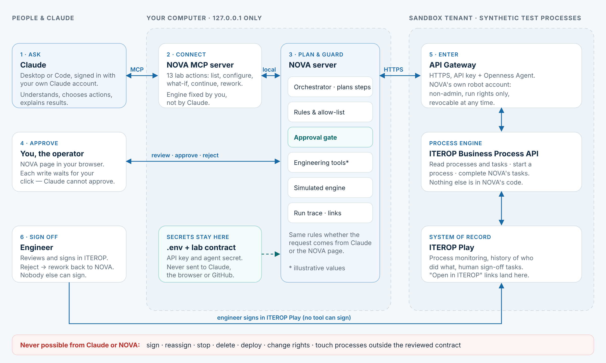

# Drive the ITEROP lab from your Claude account

NOVA can plug into Claude as an **MCP connector**. You talk to Claude in plain language, in Claude Desktop or Claude Code, signed in with your own account (Enterprise, Team, Pro…). Claude chooses NOVA's process actions, and NOVA runs them against the simulated engine or the sandbox tenant.



```
You ──► Claude (your account) ──MCP──► NOVA MCP server ──HTTP──► local NOVA server ──► API Gateway ──► ITEROP
                                                                      ▲
                                        you approve each write here ──┘  (http://127.0.0.1:3000/lab)
```

## What Claude can and cannot do

| Claude can | Claude cannot |
|---|---|
| List startable processes, your tasks and run status | Pick the engine: the operator sets it in `.env` |
| Configure the cooling chain, change an input, continue a run, handle rework, register a candidate requirement | Approve a sandbox write, by default: a person clicks **Approve** in NOVA |
| Read a run's trace and outputs, and give you the NOVA and ITEROP links | Sign, reassign, stop, delete, deploy or change rights: these tools do not exist |
| Ask you for missing values and explain results in any language | See the API key, agent secret or tenant credentials |

Claude fills structured fields, for example `itLoadKw: 1200`. NOVA turns them into a fixed command that the same deterministic orchestrator runs. The refusals, the allow-list of operations and the approval gates are therefore identical to the `/lab` page. Sandbox runs are **shared** between Claude and the page. A run Claude prepares appears at `/lab?source=live` within a few seconds, marked **Claude**, with the prepared write waiting for your click.

## Setup (Windows example)

1. Keep NOVA running: `npm run dev` in the repository folder.
2. Edit `.env` in the repository:
   ```dotenv
   NOVA_LAB_MCP_ENGINE=live       # or synthetic for the simulated engine
   NOVA_LAB_MCP_APPROVAL=portal   # writes approved by a person in NOVA (recommended)
   ```
   Restart `npm run dev` after editing `.env`.
3. **Claude Desktop:** open *Settings → Developer → Edit config* and add the following to `claude_desktop_config.json`, then fully quit and restart Claude Desktop:
   ```json
   {
     "mcpServers": {
       "nova-lab": {
         "command": "cmd",
         "args": ["/c", "cd /d E:\\users\\opt2.ai\\NOVA\\3dx-mcp-gateway && node --import tsx server/mcp.ts"]
       }
     }
   }
   ```
   On macOS or Linux use `"command": "sh", "args": ["-c", "cd /path/to/3dx-mcp-gateway && node --import tsx server/mcp.ts"]`.
4. **Claude Code**, from the repository folder: `claude mcp add nova-lab -- node --import tsx server/mcp.ts`.
5. In Claude, check that the **nova-lab** tools are listed. In the tool permissions, keep **Ask** for `lab_approve_write`.

On an Enterprise or Team plan, an organisation admin can restrict local MCP servers in Claude Desktop. If the tools do not appear, ask whoever manages your Claude organisation.

## Try it

- "Which processes can NOVA start on the sandbox?"
- "Configure the cooling chain for a 1.2 MW hall with 32 °C facility water, 16 racks, N+1."
  Claude prepares the start, then gives you a NOVA link: approve there, and say "continue" to Claude.
- "What's waiting for me? If the engineer rejected anything, handle the rework."
- "What changes if facility water goes to 38 °C?"

The engineer's sign-off stays in ITEROP Play. Claude reports when a run is waiting for it.

## The iterop-orchestrator skill

`.claude/skills/iterop-orchestrator/SKILL.md` teaches Claude how to use these tools: when to call which action, the approval etiquette, the process definitions and limits, refusals and how to report. Claude Code loads it automatically in this repository. For Claude Desktop or claude.ai, zip the `iterop-orchestrator` folder and upload it under *Settings → Capabilities → Skills*. The skill is the know-how and the MCP server is the hands, so install both.

## Options and boundaries

- `NOVA_LAB_MCP_APPROVAL=client` lets Claude send a write after you confirm Claude's own tool-permission prompt. Use it only if you keep that prompt on **Ask every time**; with "Always allow", Claude would approve without you.
- **Data:** Claude only sees the tool results, which contain the lab processes' synthetic values, statuses and run references, never credentials. The conversation is processed under your Claude account's terms.
- **claude.ai on the web** needs a remote MCP connector served over HTTPS. NOVA's runtime is deliberately loopback-only, so that route needs the hosted design described in the handover: authentication, multi-user storage and network.
- The MCP server refuses any `NOVA_LAB_URL` that is not the local machine.
